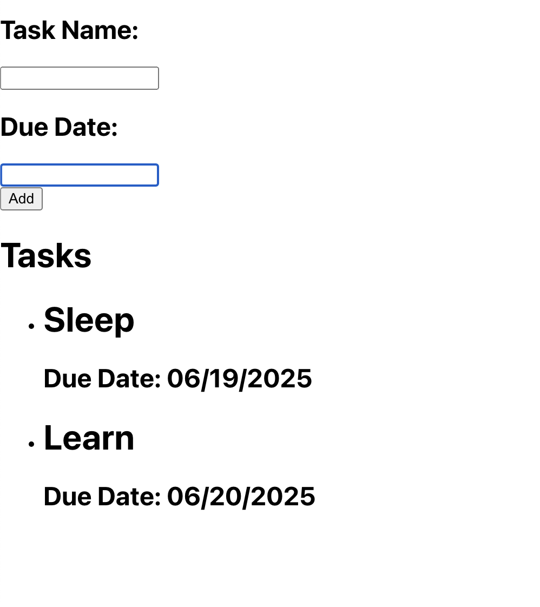

# Honda Form
I wanted to take some time to complete the same code challenge once I got home, but this time I am free to search through documentation and clear my blocks. 

Below you can find the resources that helped me work out my syntax errors, I will take about an hour from beginning (creating a repo) to end.

## Resources explored
[Input onChange](https://www.geeksforgeeks.org/reactjs/react-onchange-event/)
[Updating arrays in state](https://react.dev/learn/updating-arrays-in-state#:~:text=Instead%2C%20create%20a%20new%20array%20which%20contains%20the%20existing%20items%20and%20a%20new%20item%20at%20the%20end.%20There%20are%20multiple%20ways%20to%20do%20this%2C%20but%20the%20easiest%20one%20is%20to%20use%20the%20...%20array%20spread%20syntax%3A)
[Avoid unneccessary rerender](https://www.w3schools.com/jsref/event_preventdefault.asp)

## Icebox
- styling, center the form, fonts, colors, and boarder around tasks
- handleDelete functionality for tasks
- only accept valid date format
- validation on text form fields

# Screenshots

